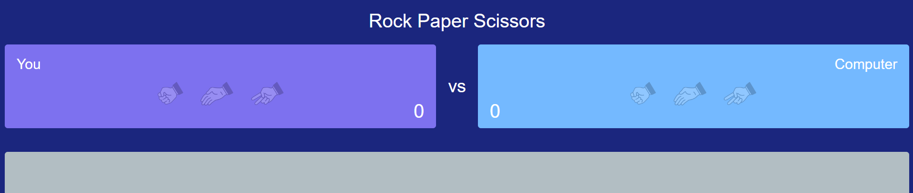

# Rock, Paper, Scissors
- The aim of this project is to build a Rock, Paper, Scissors game that helped me improve my coding skills through the construction of this project.

## Table of contents
- Overview
- The project
- Rules
- Screenshot
- Main Technologies
- Useful resources
- Author
- Acknowledgments
Note: Delete this note and update the table of contents based on what sections you keep.

- Testing 

### Validator Testing 

## Deployment

## Credits 

### Overview
 
In this game, Users should be able to:

- View the best layout for the game based on the screen size of their device.
- Play Rock, Paper, Scissors against the computer.
- See the state of the score and the results.

### Rules

 X

- Paper beats Rock

 X

- Rock beats Scissors

 X

- Scissors beats Paper

### Screenshot

.png)

.png)

.png)

### Main Technologies

This project it has been built using  Semantic HTML5 markup, CSS custom properties and  JavaScript technologies learned in The Learning Management System (LMS) by Code Institute.

### Useful Resources

  Built with help [YouTube tutorials]:

 - https://www.youtube.com/playlist?list=WL
Como criar um Jogo Pedra, Papel e Tesoura em HTML, CSS e JavaScript - 
Felipe - Dev Samurai

- https://www.youtube.com/watch?v=jaVNP3nIAv0&list=WL&index=5&ab_channel=freeCodeCamp.org
Web Development Tutorial - JavaScript, HTML, CSS - Rock Paper Scissors Game  - 
freeCodeCamp.org

### Useful Resources

### Testing 

### Validator Testing 

### Unfixed Bugs

### Deployment

### Credits 

### Features Left to Implement

## Testing 

### Validator Testing 

### Unfixed Bugs

Styled Components - For styles
Note: These are just examples. Delete this note and replace the list above with your own choices

What I learned
Use this section to recap over some of your major learnings while working through this project. Writing these out and providing code samples of areas you want to highlight is a great way to reinforce your own knowledge.

Continued development
Use this section to outline areas that you want to continue focusing on in future projects. These could be concepts you're still not completely comfortable with or techniques you found useful that you want to refine and perfect.

Note: Delete this note and the content within this section and replace with your own plans for continued development.

Useful resources
Example resource 1 - This helped me for XYZ reason. I really liked this pattern and will use it going forward.
Example resource 2 - This is an amazing article which helped me finally understand XYZ. I'd recommend it to anyone still learning this concept.
Note: Delete this note and replace the list above with resources that helped you during the challenge. These could come in handy for anyone viewing your solution or for yourself when you look back on this project in the future.

Author
Website - Add your name here
Frontend Mentor - @yourusername
Twitter - @yourusername
Note: Delete this note and add/remove/edit lines above based on what links you'd like to share.

Acknowledgments
This is where you can give a hat tip to anyone who helped you out on this project. Perhaps you worked in a team or got some inspiration from someone else's solution. This is the perfect place to give them some credit.

Note: Delete this note and edit this section's content as necessary. If you completed this challenge by yourself, feel free to delete this section entirely.

 
