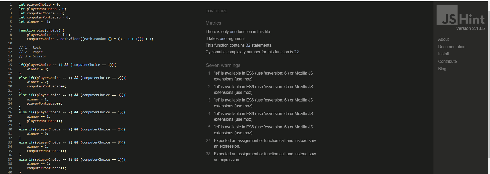

# Rock, Paper, Scissors
- The aim of this project is to build a Rock, Paper, Scissors game that helped me improve my coding skills through the construction of this project.

## Table of contents
- UX & Design
- Color Scheme
- Rules
- Screenshot
- Main Technologies
- Useful Resources
- Validator Testing
- Unfixed Bugs
- Deployment
- Credits
- Acknowledgments

## UX & Design
 
The game is a single-serving site with an only one page. In this game, Users should be able to:

- View the best layout for the game based on the screen size of their device.
- Play Rock, Paper, Scissors against the computer.
- See the site name at the top of the page.
- See the state of the score and the results.

## Color Scheme

- Coolors.co was used to choose the colour scheme of the game.

.png)

## Rules

 X

- Paper beats Rock

 X

- Rock beats Scissors

 X

- Scissors beats Paper

## Screenshot

- Game Image Area
  - The game image are lets the user know if he/she is winning or losing.

.png)

.png)

.png)

-  Scoreboard
  - The scoreboard displays the progress of the game and shows the score of the user and computer.
 .png)

## Main Technologies

This project it has been built using the following list of technologies learned in The Learning Management System(LMS) by Code Institute:

- Semantic HTML5 used to create the structure of the site.
- CSS custom properties used to add style to the site.
- JavaScript technologies used to add functionalities to the game.
- GitHub was used to store the code of the project.

## Useful Resources

  Built with help [YouTube tutorials]:

 - https://www.youtube.com/playlist?list=WL
Como criar um Jogo Pedra, Papel e Tesoura em HTML, CSS e JavaScript - Felipe - Dev Samurai

- https://www.youtube.com/watch?v=jaVNP3nIAv0&list=WL&index=5&ab_channel=freeCodeCamp.org
Web Development Tutorial - JavaScript, HTML, CSS - Rock Paper Scissors Game  - freeCodeCamp.org

## Validator Testing 

- HTML
  - No errors or warning were returned throughout the official:  https://validator.w3.org
.png)

- CSS
  - No errors or warnings were returned throught the official W3C CSS Validation Service: https://jigsaw.w3.org/css-validator/
.png)

## Unfixed Bugs

- JS Hint

## Deployment

- The website was uploaded to pages on GitHub. The following are the deployment steps:
  - Go to the Settings tab in the GitHub repository.
  - Click "Save" after selecting the Main Branch from the drop-sown menu for the source section.
  - A detailed ribbon display will be displayed to indicate the successful deployment after the page is refreshed automatically.

## Acknowledgments

- This project was made with the inspiration from  Youtube tutorials, especially from Felipe Dev Samurai's  solution. I would like to give special thanks for his work in helping and teach new developers.

   - https://www.youtube.com/playlist?list=WL
    Como criar um Jogo Pedra, Papel e Tesoura em HTML, CSS e JavaScript - Felipe - Dev Samurai

 
